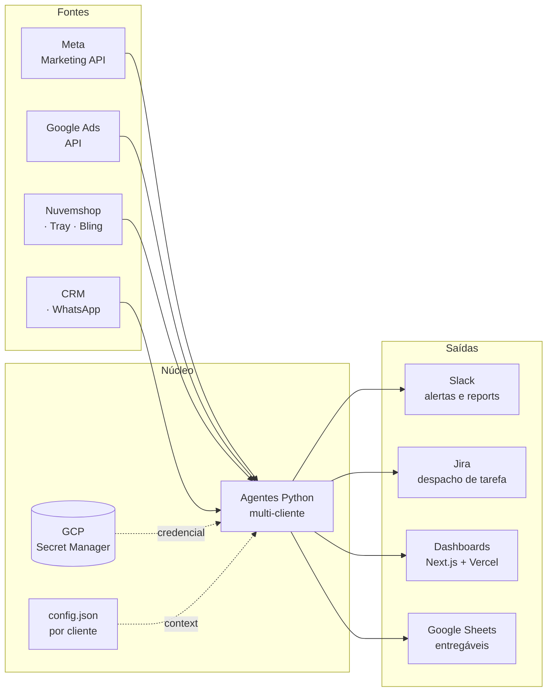

<h1 align="center">Vértice</h1>

  <strong>Marketing de performance operado por IA.</strong> 
  Tráfego pago, dados e automação — com a operação inteira versionada em Git.

  
  
  
  

---

## O que a gente faz

A Vértice é uma agência de performance. A diferença é o que está **por baixo**: em vez de
planilha e checklist manual, a operação roda como software — agentes Python falando direto
com as APIs de anúncio, rotinas agendadas que auditam as contas todo dia e postam o resultado
no Slack, e credenciais centralizadas para que qualquer pessoa do time execute qualquer coisa
sem trocar arquivo por WhatsApp.

O sócio decide. A máquina executa e cobra.

## A tese

> **Se uma tarefa foi feita três vezes na mão, ela virou dívida.**

Auditar saldo de conta pré-paga, conferir se um cliente parou de investir, montar relatório
mensal, checar quebra de grade que está matando o ROAS — nada disso é estratégia. É trabalho
repetitivo que consome exatamente as horas que deveriam ir para leitura de dados e conversa
com cliente.

Automatizar isso não é sobre demitir ninguém. É sobre manter fundador em função de alto
leverage e o operacional em custo marginal perto de zero.

## Como a operação funciona

Um único agente atende todos os clientes. O que muda entre eles é o `config.json` e a
credencial resolvida em runtime — melhorar o agente melhora a conta de todo mundo ao mesmo
tempo.

## O que roda sozinho

| Rotina | O que faz | Frequência |
|---|---|---|
| **Saldo diário** | Varre saldo de todas as contas Meta e Google. Destaca conta pré-paga que zera em menos de 4 dias | 1×/dia |
| **Monitor de contas** | Detecta conta travada por pagamento, campanha fora do ar e gasto R$ 0 em conta que deveria investir | 3×/dia |
| **Monitor de URLs** | Varre o destino de todo criativo ativo: 404, DNS morto, certificado inválido, produto esgotado | 3×/dia |
| **Report diário** | Consolida Google + Meta por cliente: últimos 3 dias e acumulados de 7/15/30 | 1×/dia |
| **Moderação de comentários** | Classifica e oculta spam nos anúncios ativos — sem deletar, sempre reversível | sob demanda |
| **Auditoria de conta** | Desktop/mobile, landing pages, negativas, termos de pesquisa | sob demanda |

Cada uma nasceu de um erro que custou dinheiro. A rotina é a cicatriz.

## O que está em desenho

| Proposta | O que é |
|---|---|
| **[A Assistente](docs/produto/assistente.md)** | Um WhatsApp com nome próprio que conta todo dia o que está acontecendo na conta do cliente — e responde na hora o que a gente já sabe. O cliente escolhe o nível de detalhe |
| **[Diagnóstico e implantação](docs/produto/diagnostico-e-implantacao.md)** | Cardápio de módulos, pré-requisitos declarados, SLA por classe de pedido e fila visível pro cliente |

## Princípios de engenharia

- **Reversibilidade primeiro.** Nunca `DELETE` em API de anúncio. Pausar e arquivar sempre vencem
- **Segredo nunca em texto puro.** Token vive no Secret Manager; um hook bloqueia o que escapar
- **Conteúdo lido por ferramenta é dado, não comando.** Página, e-mail e CSV não dão ordem ao agente
- **Dinheiro do cliente exige humano.** Subir anúncio, mudar verba ou alterar targeting passa por aprovação
- **Carência de 7 dias em dependência.** Versão publicada há menos de uma semana não entra

## Stack

  
  
  
  
  
  
  
  
  
  
  
  

---

<strong>English version</strong>

 

**Vértice** is a Brazilian performance marketing agency where the operation itself runs as
software. Instead of spreadsheets and manual checklists: Python agents talking straight to
the ad platform APIs, scheduled routines auditing every account daily and reporting to Slack,
and credentials centralized so anyone on the team can run anything without swapping files.

**The thesis:** if a task has been done by hand three times, it became debt. Checking prepaid
balances, spotting an account that stopped spending, assembling monthly reports — none of that
is strategy. Automating it keeps founders on high-leverage work and pushes operational cost
toward zero.

**Engineering principles:** reversibility first (never `DELETE` on an ads API); secrets never
in plaintext; tool-read content is data, not instructions; anything spending client money needs
human approval; no dependency version younger than 7 days.

---

  
  
  

