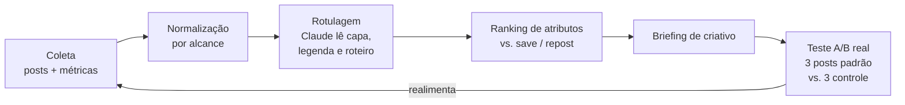

# Radar de conteúdo

**Status: arquivada** em 2026-09-01, no mesmo dia em que foi escrita · **Origem:** conversa de
2026-09-01 · **Se conectava com:** [A Assistente](../produto/assistente.md)

> Pegar o que já deu certo — nas contas do cliente e no que é público — achar o padrão por trás,
> e transformar isso em briefing de criativo.

## Por que está arquivada

Duas razões, nesta ordem:

1. **Não existe leaderboard público** (§2 abaixo). O CrowdTangle morreu, o sucessor é fechado
   pra pesquisa acadêmica, e sem isso a ideia perde a parte que a tornava barata: olhar o que
   já é sucesso e copiar o padrão. Sobra modelar dado próprio, que é trabalho de meses.
2. **Caçar post viral não é o objetivo da Vértice.** A casa vive de performance paga, não de
   alcance orgânico. Mesmo que a modelagem funcionasse, ela entrega pauta de conteúdo — produto
   de outra agência.

**O que sobreviveu e migrou:** a única parte com retorno imediato é comprar uma base de benchmark
(Socialinsider ou Rival IQ) pra ter a mediana do setor e poder dizer "seu 0,7% é bom". Isso é
decisão de compra, não de engenharia, e virou item no
[cardápio de módulos](../produto/diagnostico-e-implantacao.md).

**O que faria isso voltar à mesa:** um cliente pagando especificamente por estratégia de conteúdo
orgânico, ou a Meta reabrindo acesso amplo a dado público de plataforma. Nenhum dos dois está no
horizonte.

O resto do documento fica como está — a pesquisa de API abaixo é válida e economiza a redescoberta
se o assunto voltar.

---

## 1. A pergunta original

*"Post que faz sucesso no Instagram hoje tem relação com quanto ele é repostado? O que dá mais
like, mais save, mais repost — dá pra modelar isso?"*

A pergunta tem duas partes, e elas têm respostas bem diferentes.

## 2. O que a API realmente entrega

Esta é a parte que decide se a ideia é viável, então vem antes de qualquer método.

### Nas contas que a gente administra — dado rico

Para conta profissional (Business/Creator) com acesso concedido, o endpoint de mídia e o de
insights entregam, por post:

- `likes`, `comments`, `saved`, `shares`, `views`, `reach`, `total_interactions`
- `profile_visits`, `follows` gerados pelo post
- métricas de Reels (tempo médio assistido, replays)
- **contagem de repost** — métrica adicionada recentemente, em nível de mídia (quantas vezes
  aquele post/Reel foi repostado no perfil de outra pessoa) e em nível de conta

Detalhe importante sobre repost: ela conta **repost público pro perfil**, e **não** inclui
compartilhamento por Stories nem por DM. É métrica diferente do campo `shares` antigo. Ou seja,
"repost" e "compartilhamento" são dois eixos distintos e vale medir os dois separados.

### Nas contas dos outros — dado pobre

Pra concorrente ou conta de referência, o caminho oficial é o *Business Discovery*, e ele só
devolve o que é público:

`followers_count`, `media_count`, `caption`, `media_type`, `media_url`, `permalink`,
`timestamp`, `like_count`, `comments_count`.

**Não** vem `saved`, **não** vem `shares`, **não** vem repost, **não** vem alcance. E ainda:
exige conta profissional pública do outro lado, passa por App Review, e tem limite de ~200
chamadas/hora por conta conectada.

Consequência direta pro projeto:

> **A hipótese de repost só é testável nas contas que a gente administra.** Em conta de terceiro,
> o máximo é like + comentário + recência — sem saves e sem alcance, não dá nem pra normalizar.

Isso não mata a ideia; muda o alvo. O ativo não é espionar concorrente, é **modelar o que
funciona na conta do próprio cliente** — que é onde tem dado de verdade e onde a recomendação
pode ser testada.

E fica o registro do que **não** vamos fazer: scraping de Instagram pra suprir o que a API não dá.
Viola os termos, arrisca o acesso das contas dos clientes e é caro de manter contra mudança de
layout. O limite da API é o limite do produto.

### Não existe leaderboard público da plataforma

A pergunta natural é: não tem um lugar onde dá pra consultar os melhores posts do Instagram por
métrica? **Não tem, e não é descuido — é decisão da Meta.** O que existe:

| Fonte | O que dá | O que não dá |
|---|---|---|
| **Meta Content Library** (sucessor do CrowdTangle, que foi desligado em ago/2024) | Conteúdo público de Facebook e Instagram com contagens de engajamento | Acesso por candidatura e triagem — pesquisador acadêmico ou newsroom sem fins lucrativos. Agência não entra. Exportação automatizada não é permitida |
| **Estudos de benchmark** (Socialinsider, Rival IQ, Metricool) | Medianas de engajamento por setor e por formato — Instagram rodando em torno de 0,3%–0,5% por post, com carrossel e Reels disputando a ponta | Post individual. É agregado, publicado uma ou duas vezes por ano |
| **Painel profissional do Instagram** | Áudio em alta, sugestões de tendência dentro do app | Nada consultável por API, nada comparável entre contas |
| **Raspadores de terceiros** (Apify e afins) | Quase tudo | Roda contra os termos e coloca em risco o acesso das contas dos clientes. Fora de escopo |

O uso certo dos benchmarks não é procurar padrão neles — é **denominador**. Eles respondem "0,7%
de engajamento é bom?", e essa é exatamente a frase que falta num relatório pro cliente. Descobrir
padrão continua sendo trabalho de dado próprio.

## 3. A hipótese que vale testar

A intuição original — **repost é feature nova, e plataforma empurra o que acabou de lançar** —
está certa no formato, mas a própria Meta já entregou uma pista mais forte e mais barata de
testar.

Adam Mosseri declarou publicamente quais são os sinais que mais pesam no ranqueamento:
**tempo assistido**, **likes por alcance** e **sends por alcance** — sends sendo o
compartilhamento por DM. E a distinção entre eles é o que interessa aqui: like por alcance pesa
pra alcançar quem já segue; **send por alcance é o que empurra pra quem não segue**.

Isso muda a ordem das apostas:

> **H1 (principal)** — entre posts da mesma conta, `shares/reach` prevê alcance futuro melhor do
> que `likes/reach`. É a hipótese que a própria plataforma afirma; o valor de testar é confirmar
> que vale **para este nicho**, e descobrir *qual atributo de criativo* produz send.
>
> **H2 (a aposta)** — repost público pro perfil, métrica nova e separada de send, carrega o bônus
> de alcance que plataforma costuma dar pra feature recém-lançada. Se for verdade, é vantagem
> temporária — e temporária é exatamente quando vale correr.

A consequência prática, se qualquer uma se sustentar, é a mesma e é grande: **parar de otimizar
criativo pra like e começar a otimizar pra "alguém mandar isso pra outra pessoa"** — que é
conteúdo bem diferente. Like é conteúdo bonito; send é conteúdo que diz algo sobre quem manda
(opinião, dado surpreendente, piada de nicho, utilidade que serve pra alguém específico).

Hipóteses irmãs, mesmo método: **H3** save prevê retorno de audiência (utilidade) · **H4**
comentário prevê alcance mas não conversão · **H5** o padrão é específico do nicho e não transfere
entre clientes.

Nota de método que vem de graça com isso: o vocabulário certo é **por alcance**, não absoluto —
a própria plataforma raciocina assim. Reforça o passo 2 do §4.

## 4. Método

**1. Coleta.** Histórico de mídia + insights das contas do cliente, salvo em base própria. Insight
de Instagram tem janela de retenção — quem não coleta, perde. Começar a coletar é a tarefa mais
urgente do projeto, mesmo antes de existir modelo. Prioridade de campos, na ordem do que a
plataforma diz pesar: **tempo assistido** (Reels), `shares`, `likes`, `saved`, contagem de
repost — todos junto de `reach`, que é o denominador de tudo.

**2. Normalização.** Nada de métrica absoluta. Tudo vira taxa sobre alcance (`saved/reach`,
`repost/reach`), e comparado **dentro da mesma conta e do mesmo período** — conta cresce, alcance
oscila, e comparar post de janeiro com post de agosto sem isso é ruído puro.

**3. Rotulagem.** Claude lê capa, legenda, primeiros segundos e transcrição e marca atributos:
formato, tipo de gancho, duração, tem rosto?, tem texto na capa?, tema, tom, tem CTA?, é UGC?,
é opinião ou utilidade?. É aqui que a análise deixa de ser "qual post foi bem" e vira "qual
**característica** vai bem".

**4. Ranking.** Com dezenas de posts e não milhares, o certo é comparação de médias por atributo
com intervalo de confiança — não regressão sofisticada em cima de N=40. O output honesto é
"posts com gancho de opinião tiveram 2,3× a taxa de repost, em 11 casos".

**5. Briefing.** O achado vira pauta concreta: três ideias de post que carregam o atributo
vencedor, prontas pra produção.

**6. Teste.** O único passo que prova alguma coisa. Sobe 3 com o padrão, 3 sem, mesma semana,
compara. Sem essa etapa, o resto é astrologia com planilha.

### O que pode dar errado na estatística

- **N pequeno.** Uma conta posta 20 vezes por mês. Padrão que aparece em 3 posts não é padrão.
- **Causalidade invertida.** O algoritmo entrega mais o que já performou; o post não foi bem por
  ser bom, foi entregue por ser bom no primeiro minuto. Só o teste do passo 6 separa isso.
- **Confundidor de tema.** "Post com rosto vai melhor" pode ser só "os posts com rosto eram sobre
  o assunto que a audiência gosta".
- **Sazonalidade e mão do editor.** Editor melhora ao longo do tempo; post recente vence post
  antigo por motivo nenhum ligado ao padrão.

Nome honesto do que isso entrega: **gerador de hipótese de criativo**. Quem prova é o teste.

## 5. Como isso vira produto

**Interno primeiro (Casa dos Craques).** Nicho com sinal forte e volume de conteúdo. Se o padrão
aparecer lá, aparece.

**Depois, dentro da Assistente.** Duas conexões naturais com o produto do outro documento:

- **Achado da semana**, empurrado no nível 3+: *"seus 3 posts com mais save no mês tinham dado
  numérico na capa. Sugestão de pauta pra semana: …"*
- **Pergunta livre**, em qualquer nível: *"quais posts mais salvaram esse mês?"*, *"o que está
  funcionando melhor: opinião ou tutorial?"*

**Depois, como serviço vendável.** Aí a limitação do §2 vira parte do contrato: só entra cliente
que dá acesso à conta profissional. Sem acesso, não tem dado; sem dado, não tem produto — e isso
se alinha ao diagnóstico de pré-requisitos descrito em
[Diagnóstico e implantação](./diagnostico-e-implantacao.md).

## 6. Próximo passo concreto

Não é modelar. É **começar a guardar**:

1. Job diário que puxa mídia + insights das contas de Instagram dos clientes que já deram acesso
   e grava em base própria (histórico é ativo, e a janela de retenção da API não espera).
2. Rodar 30 dias.
3. Só então rotular e olhar o ranking — com dado suficiente pra alguma conclusão não ser sorte.

## 7. Em aberto

1. **Quais clientes já têm conta profissional conectada** com permissão de insights? Levantar
   antes de qualquer código.
2. **A contagem de repost está disponível na versão de API que a gente usa hoje?** Confirmar na
   documentação oficial (o acesso a `developers.facebook.com` está bloqueado deste ambiente).
3. **Vale a pena o App Review pro Business Discovery?** Só se a conclusão for "concorrente ajuda a
   pautar" — com like e comentário apenas, provavelmente não paga o esforço.
4. **TikTok entra?** A pergunta original falava em "outras redes"; TikTok tem API própria e outro
   escopo de trabalho.
5. **Assinar uma base de benchmark?** Socialinsider ou Rival IQ dão a mediana do setor — o
   denominador que falta pra dizer "seu 0,7% é bom". Custo baixo, entra direto no relatório e na
   Assistente. Decisão de compra, não de engenharia.

---

## Fontes consultadas

- [Insights — Instagram Platform, Meta for Developers](https://developers.facebook.com/docs/instagram-platform/insights/)
- [Business Discovery — Meta for Developers](https://developers.facebook.com/documentation/instagram-platform/instagram-api-with-facebook-login/business-discovery)
- [Meta Announces Updates for the Instagram Marketing API — Social Media Today](https://www.socialmediatoday.com/news/meta-announces-updates-for-the-instagram-marketing-api/807083/)
- [Meta rolls out new Instagram API features for branded content and analytics — Social Samosa](https://www.socialsamosa.com/news-2/meta-instagram-api-features-branded-content-analytics-11760299)
- [Instagram Business Discovery API: What Can You Actually Get? — KeyAPI](https://www.keyapi.ai/blog/instagram-business-discovery-api/)
- [How Instagram's Updated Marketing API Metrics Work — Storrito](https://storrito.com/resources/how-instagrams-updated-marketing-api-metrics-work/)
- [Instagram "Sends per Reach" Playbook — Influencer Marketing Hub](https://influencermarketinghub.com/instagram-sends-per-reach-playbook/)
- [The 3 Most Important Instagram Metrics for Reach (Mosseri) — Torro](https://torro.io/blog/3-most-important-instagram-metrics-for-reach)
- [CrowdTangle — Meta Transparency Center](https://transparency.meta.com/researchtools/other-data-catalogue/crowdtangle/)
- [A First Look at Meta's New Content Library and Content Library API — Social Media Lab](https://socialmedialab.ca/web/2024/03/25/a-first-look-at-metas-new-content-library-and-content-library-api/)
- [Meta Is Getting Rid of CrowdTangle — Columbia Journalism Review](https://www.cjr.org/tow_center/meta-is-getting-rid-of-crowdtangle.php)
- [2026 Instagram Organic Engagement Benchmarks — Socialinsider](https://www.socialinsider.io/social-media-benchmarks/instagram)
