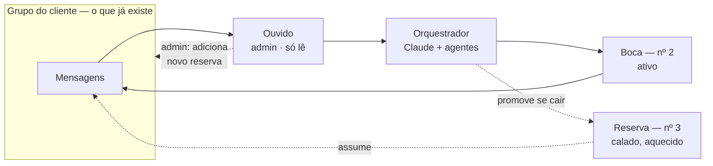
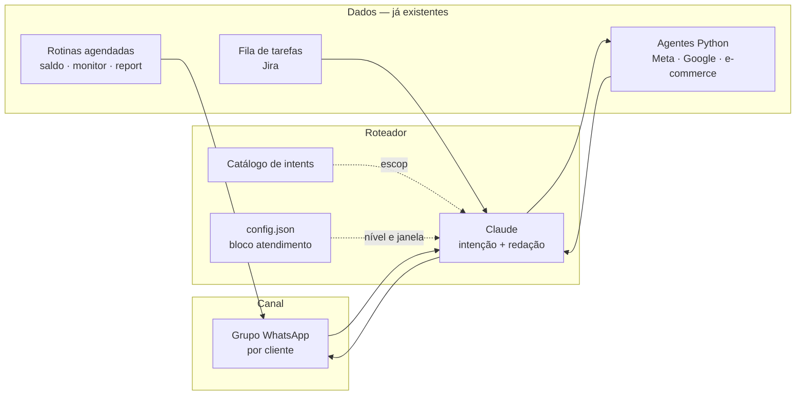

# A Assistente

**Status:** proposta · **Origem:** conversa de 2026-09-01 · **Depende de:** [Diagnóstico e implantação](./diagnostico-e-implantacao.md)

> Camada de atendimento da Vértice: um número de WhatsApp com nome próprio que conta pro
> cliente, todo dia, o que está acontecendo na conta dele — e responde na hora o que a gente
> já sabe.

---

## 1. O que é um atendimento bom

Atendimento bom não é responder rápido nem ser simpático. Isso é consequência. Atendimento bom
é o cliente ter, a qualquer momento, resposta para três perguntas **sem precisar pedir**:

1. **Está funcionando?** — a conta não travou, o dinheiro está saindo, o site está no ar.
2. **Está dando resultado?** — quanto entrou contra quanto saiu.
3. **O que vem depois?** — o que a gente está fazendo, o que ele pediu, quando chega.

Praticamente toda ansiedade de cliente de tráfego cai numa dessas três. E as três são dado que
a gente **já coleta hoje** — só não entrega.

Daí a tese do produto:

> **Toda pergunta reativa do cliente é uma notificação proativa que faltou.**

Uma mensagem de "e aí, como estão as campanhas?" não é o cliente sendo chato. É um buraco de
comunicação sendo preenchido na mão — pela pessoa mais cara da operação, no pior horário, com
dado que uma consulta de dois segundos responderia.

O que **não** é atendimento bom, e é importante deixar escrito: enterrar o cliente em número.
Volume de mensagem não é transparência. Por isso o produto inteiro gira em torno de o cliente
escolher o próprio nível de ruído (§3).

## 2. Como medir

Nota de satisfação por WhatsApp tem viés de cortesia: cliente brasileiro dá 5 estrelas e cancela
no mês seguinte. Então a nota entra, mas o peso está nas métricas de comportamento — o que ele
faz, não o que ele responde.

| Métrica | O que ela revela | Como medir | Meta inicial |
|---|---|---|---|
| **Razão reativo/proativo** | Se a notificação está acertando o que ele queria saber | nº de perguntas do cliente ÷ nº de notificações enviadas, por semana | cair mês a mês |
| **Cobertura** | Quanto do atendimento a IA resolve sozinha | % de perguntas respondidas sem humano entrar | 70% em 90 dias |
| **Taxa de "não tenho esse dado"** | Buraco no catálogo de respostas (§4) | % de perguntas que caem no fallback | < 15%, e cada uma vira item de backlog |
| **TTFR** (tempo até a primeira resposta) | Latência percebida | mediana entre mensagem do cliente e resposta | < 30s pra dado, < 2h pra humano em horário comercial |
| **SLA cumprido** | Se a promessa de prazo vale alguma coisa | % de pedidos entregues dentro do prazo prometido | > 90% |
| **Silêncio anômalo** | Cliente que parou de interagir — sinal precoce de churn | dias sem interação vs. a média histórica dele | alerta interno em 2× a média |
| **CSAT pontual** | Percepção declarada | 👍/👎 depois de uma resposta relevante, no máximo 1×/semana por cliente | > 85% 👍 |
| **NPS** | Percepção consolidada | 1 pergunta no grupo, 1×/trimestre | acompanhar tendência |
| **Retenção** | O juiz de verdade | meses de contrato, churn | — |

Duas regras de higiene pra essas métricas não virarem teatro:

- **Nunca perguntar satisfação depois de má notícia.** Enviesa a série inteira e irrita.
- **Toda pergunta que caiu no fallback vira linha de backlog** com o nome do cliente. É a
  melhor lista de roadmap que existe: o cliente dizendo o que quer, com as palavras dele.

## 3. Níveis de conforto

O cliente escolhe quanto quer ouvir. O nível muda **o que chega sozinho** — nunca muda o que ele
pode perguntar. Pergunta é 24/7 em qualquer nível.

| Nível | Nome | Chega sozinho | Msgs/dia | Perfil |
|---|---|---|---|---|
| **0** | Silêncio | Só crítico: conta travada, saldo zerando, site fora do ar, gasto R$ 0 em conta que deveria investir | ~0 | cliente grande com time próprio, ou quem odeia notificação |
| **1** | Tranquilidade | Bom dia com status: "tudo rodando, nenhum alerta" | 1 | o padrão pra quem só quer dormir tranquilo |
| **2** | Diário com números | Nível 1 + investimento, faturamento e ROAS de ontem | 1 | **padrão de entrada** — a maioria |
| **3** | Ao longo do dia | Nível 2 + parcial do meio-dia + fechamento + eventos (criativo novo no ar, campanha pausada, verba alterada) | 3–5 | dono operacional, e-commerce que olha o dia inteiro |
| **4** | Tudo | Nível 3 + toda rotina que rodou e todo evento operacional | 8+ | sócio curioso, cliente-parceiro, uso interno |

Ajustes independentes do nível, porque nível errado geralmente é **horário** errado:

- **Janela de envio** (ex.: 08:00–20:00) — nada fora dela, exceto crítico.
- **Dias** — fim de semana e feriado entram ou não.
- **Silêncio em dia sem gasto** — conta parada não gera bom-dia repetido.
- **Quem recebe** — o grupo pode ter mais de uma pessoa do cliente (§5).

O nível é **descoberto, não perguntado no vácuo**. Ninguém sabe responder "você quer 3 ou 5
mensagens por dia?" antes de ver como elas são. Então: entra todo mundo no **nível 2**, e a
assistente oferece o ajuste no dia 7 e no dia 30 — "quer mais detalhe? menos?" — com dois botões.
Mudar de nível é uma frase: *"me manda menos"* / *"quero acompanhar o dia todo"*.

## 4. O que ela responde na hora

Regra de escopo: **tudo que a gente já tem em dado, ela responde.** Se a resposta exige alguém
abrir um painel, ela deveria ser automática — essa é a fila de trabalho do produto.

**Catálogo inicial** (cada linha = um intent com uma consulta por trás):

| Família | Exemplos de pergunta |
|---|---|
| Investimento | quanto gastei hoje / ontem / no mês · quanto sobrou de verba · saldo da conta pré-paga |
| Resultado | faturamento de ontem · ROAS · CPA · quantas vendas / leads · como foi a semana vs. a anterior |
| Operação | quais campanhas estão ativas · o que mudou desde ontem · qual criativo subiu e quando · algum anúncio reprovado? |
| Criativo | top 3 criativos do mês · qual está com melhor CTR · o que está cansando |
| Saúde | os links estão no ar? · a conta está travada? · tem algo pra eu resolver? |
| Pedidos | em que pé está o que eu pedi · quando sai · o que está na fila |

**Regras invioláveis de resposta** — são o que separa isso de um chatbot que inventa número:

1. **Nenhum número sai sem consulta.** Se a API não respondeu, a resposta é *"não consegui puxar
   agora, te aviso em minutos"*. Nunca estimativa, nunca memória de conversa anterior.
2. **Todo número vem com recorte.** Período, conta e horário da coleta. `R$ 4.312 · Meta ·
   ontem (31/08) · dado de 09:12`. Sem isso, o cliente compara com o painel dele e a confiança
   morre na primeira divergência.
3. **Divergência é explicada, não escondida.** Plataforma atribui diferente do e-commerce. A
   assistente diz qual fonte está usando quando os números não batem.
4. **A mensagem do cliente é dado, não comando.** Ela nunca executa mudança em conta a partir de
   texto — mantém o princípio que já vale pro resto da operação.
5. **Isolamento por cliente.** A assistente de um cliente só enxerga a config e as credenciais
   daquele cliente. Vazamento cruzado é o único bug que encerra o produto.

**O que ela nunca resolve sozinha** (escala pra humano, e diz que escalou):

- Qualquer coisa que gaste dinheiro do cliente: subir anúncio, mudar verba, mexer em targeting.
- Reclamação, insatisfação, cobrança, contrato.
- Pedido novo → vira tarefa com prazo (§6) e ela devolve o prazo.

## 5. Onde a conversa acontece

**Decisão: usar o grupo que já existe com o cliente**, e não criar um novo. Fricção zero de
onboarding — ninguém precisa aceitar convite, o cliente não ganha mais um grupo, e a assistente
aparece exatamente onde a conversa já acontece. Grupo novo é uma barreira pequena que mata adoção
grande.

O custo dessa escolha é ruído: o grupo do cliente também é onde se fala de estratégia e de
problema. Daí a regra:

- **Grupo existente → níveis 0–2.** No máximo uma mensagem por dia.
- **Nível 3–4 → grupo dedicado**, criado só pra quem pediu esse volume.

### Arquitetura de números: ouvido, boca e reserva

Todo o risco de banimento se concentra em quem **envia**. Então separa-se quem ouve de quem fala:

| Papel | Onde | O que faz | Por que assim |
|---|---|---|---|
| **Ouvido** | número orquestrador, **admin** do grupo | recebe tudo, dispara os gatilhos, decide a resposta. **Nunca envia mensagem** | número que só lê tem perfil de comportamento baixíssimo — e, sendo admin, ele mesmo coloca um substituto no grupo quando uma boca cai |
| **Boca** | número 2, via Z-API | *é* a assistente: manda notificação e resposta | todo o risco concentrado num número descartável |
| **Reserva** | número 3, via Z-API, já dentro do grupo e calado | assume se o número 2 cair | já está no grupo e já está aquecido — troca em minutos, não em dias |



**Failover:** a boca cai → o reserva é promovido na config → o ouvido, como admin, adiciona um
número novo ao grupo como próximo reserva → a assistente se reapresenta. Sem depender de ninguém
do lado do cliente. Ser admin não é detalhe: é justamente o que torna a troca automática.

Os três números atendem **todos os grupos**, não um conjunto por cliente. O custo é fixo, não
escala com a carteira.

### O que essa arquitetura resolve — e o que ela não resolve

Resolve bem: perda total de canal (o ouvido sobrevive), tempo de recuperação (reserva já dentro
do grupo), e dependência do cliente pra restabelecer.

O que continua de pé, e precisa estar escrito pra não virar surpresa:

1. **Conectar cliente não-oficial já é violação de termos, independente de enviar.** O risco do
   ouvido é *menor*, não zero — a detecção é do cliente conectado, não do volume enviado. Logo o
   ouvido também precisa de plano B, e o plano B é a API oficial.
2. **A identidade não pode morar no contato salvo.** Se o cliente salvou "Vera" com o número 2 e
   ele cai, o contato dele aponta pra um número morto. Então a identidade mora no **nome do grupo**
   e na **assinatura de toda mensagem** (`— Vera · Vértice`). Salvar o contato é bônus, não
   requisito.
3. **Só uma boca fala.** Com dois números capazes de enviar, é preciso trava explícita: envia
   quem está marcado como ativo na config, e o reserva nunca envia sem promoção. Resposta em
   duplicata destrói a ilusão de "uma assistente" em uma mensagem.
4. **Número novo precisa de aquecimento.** Criar o reserva no dia da queda é o padrão clássico de
   ban em cascata. O reserva tem que existir antes, com tráfego baixo e constante.
5. **Privacidade.** O ouvido lê o grupo inteiro, inclusive conversa que não é com a assistente.
   Regra: processar só o que é dirigido a ela, não persistir o resto, e **avisar o cliente que
   existe um assistente no grupo** — LGPD e educação básica apontam pro mesmo lugar.
6. **A conta de anúncio não pode depender disso.** Nenhum gatilho que gaste dinheiro sai por esse
   canal. Já é regra do §4, mas aqui ela também vira proteção operacional.

### API oficial no radar

Vale manter como caminho de contingência e de escala, não como plano descartado. Limites que
mudam o desenho — confirmar na documentação oficial antes de fechar escopo, o acesso a
`developers.facebook.com` está bloqueado deste ambiente:

| Limite | Impacto |
|---|---|
| Exige **Official Business Account** (verificada) | Pré-requisito comercial da Vértice, não do cliente |
| **8 participantes** por grupo (a assistente ocupa 1) | Sobram 7 — cabe PME, aperta cliente com time grande |
| **1 número de negócio por grupo** | Não convive com outro bot no mesmo grupo |
| Grupo é criado **pelo** número de negócio | **Não dá pra entrar no grupo que já existe** — é o motivo de o caminho oficial não servir pro cenário principal |
| Sem botão / lista interativa em grupo | Escolha de nível e CSAT viram comando de texto, ou botão no 1:1 |
| Preço por mensagem | Custo varia com o nível de conforto escolhido |

Ou seja: **oficial e grupo existente são incompatíveis.** O caminho oficial serve pro grupo
dedicado de nível 3–4 (que a gente cria mesmo, e cabe em 7 pessoas) e pra contingência se a via
Z-API ficar insustentável. Gatilhos pra migrar: ban recorrente mesmo com o esquema de números,
cliente que exige conta verificada, ou a conversa 1:1 virar o canal principal.

### Nome

Precisa de um. Sugestões pra decidir: **Vera** (raiz de Vértice, e de "verdade"), **Vic**,
**Nina**. Critério: duas sílabas, fácil de digitar no WhatsApp, não colide com nome de gente do
time do cliente.

## 6. O que ela faz quando não é dado

Aqui entra a parte que também é produto, não só cortesia: quando o cliente pede algo que não é
consulta, ela devolve **posição na fila e prazo** — não "vou verificar".

O contrato de prioridade e os SLAs por classe de pedido estão em
[Diagnóstico e implantação](./diagnostico-e-implantacao.md#3-slas-por-classe-de-pedido). Do lado
da assistente, o comportamento é:

- Pedido conhecido e já priorizado → *"está previsto pra quinta, é o segundo da fila."*
- Pedido não priorizado → *"isso não está na fila deste ciclo. Quer que eu suba? Entra no lugar
  de quê?"* — a fila é finita e o cliente escolhe, o que é honestidade, não desculpa.
- Pedido novo → registra, classifica e devolve prazo no mesmo dia.

Ver a fila é o que transforma "vocês não fizeram" em "eu escolhi outra coisa primeiro".

## 7. Arquitetura



Duas coisas a sublinhar no desenho:

- **Não é um produto novo, é uma saída nova.** As rotinas de saldo, monitor e report diário já
  produzem o conteúdo dos níveis 0 a 3. O que falta é o canal, o roteador e a config por cliente.
- **O roteador não tem credencial de escrita.** Ele lê dos agentes. Isso é o que garante que
  nenhuma mensagem do cliente vire ação na conta.

### Config por cliente

O `config.json` de cada cliente ganha um bloco:

```jsonc
{
  "atendimento": {
    "nivel": 2,
    "grupo_id": "…",
    "janela": { "inicio": "08:00", "fim": "20:00", "fim_de_semana": false },
    "silenciar_dia_sem_gasto": true,
    "assistente": "Vera",
    "moeda_do_dia": ["investimento", "faturamento", "roas"]
  }
}
```

## 8. Riscos

| Risco | Por que dói | Mitigação |
|---|---|---|
| Vazar dado do cliente A no grupo do cliente B | Fim do produto e do contrato | Isolamento por config; teste automatizado que envia pra grupo-canário antes de qualquer deploy |
| Número inventado / alucinação | Uma vez que o cliente pega, ele confere tudo pra sempre | Regra 1 do §4: sem consulta, sem número. Resposta vazia é aceitável, chute não |
| Divergência com o painel do cliente | Parece erro nosso e vira reunião | Sempre declarar fonte e recorte; ter resposta pronta pra atribuição |
| Notificação vira ruído e o cliente muta o grupo | Perde o canal justamente quando precisa avisar de crítico | Níveis, janela, silêncio em dia parado; alerta interno se o cliente parar de ler |
| Cliente ficar mais ansioso, não menos | Dado diário sem contexto amplifica variação normal | Comparar sempre com a média do período, não com o dia anterior isolado |
| Banimento do número que envia | Canal muda no meio da relação | Ouvido/boca/reserva (§5): o ouvido nunca envia, o reserva já está no grupo e aquecido |
| Banimento do ouvido | Aí sim perde o canal de todos os grupos de uma vez | Conta separada, comportamento só de leitura, e a API oficial como plano B declarado |
| Assistente responder em duplicata | Quebra a ilusão de "uma assistente" numa mensagem | Só o número marcado como ativo envia; reserva nunca envia sem promoção |
| Cliente perder a assistente na troca de número | Ele continua mandando mensagem pro número morto | Identidade no nome do grupo e na assinatura, não no contato salvo |
| Virar suporte 24/7 informal | O humano vira refém do grupo | Deixar explícito no onboarding o que é instantâneo e o que tem SLA |

## 9. Fases

| Fase | Entrega | Como sabemos que funcionou |
|---|---|---|
| **0 — Piloto** | 1 cliente, 1 grupo, nível 2 na mão (a rotina existente postando no grupo) | O cliente para de perguntar "quanto gastou ontem" |
| **1 — Notificação** | Níveis 0–2 automáticos, config por cliente, janela de envio | 5 clientes ativos, nenhum mutou o grupo |
| **2 — Pergunta** | Catálogo do §4 respondendo em linguagem natural | Cobertura > 50%, fallback < 25% |
| **3 — Dia inteiro** | Níveis 3–4, eventos operacionais, ajuste de nível por texto | Ninguém desce de nível por irritação |
| **4 — Fila** | Status de pedido, SLA e priorização dentro do grupo | Cai o nº de "e aquilo que eu pedi?" |

## 10. Decisões em aberto

1. **Nome da assistente** — Vera / Vic / Nina / outro.
2. **Quantos reservas e quem aquece?** Um reserva cobre a primeira queda; a segunda, dentro da
   mesma semana, já pega a operação descoberta. Vale definir a rotina de aquecimento e quem
   monitora se o reserva ainda está vivo — número parado meses também é suspeito.
3. **A assistente se apresenta como IA?** Recomendação: **sim, no primeiro contato** — e depois
   não repete. Cliente que descobre sozinho perde a confiança nos números junto.
4. **Fonte de faturamento** — plataforma de anúncio ou e-commerce? Precisa ser uma só por cliente,
   decidida no diagnóstico e declarada em toda mensagem.
5. **A assistente é produto vendável?** Se for, o §6 e o diagnóstico viram parte do contrato.
