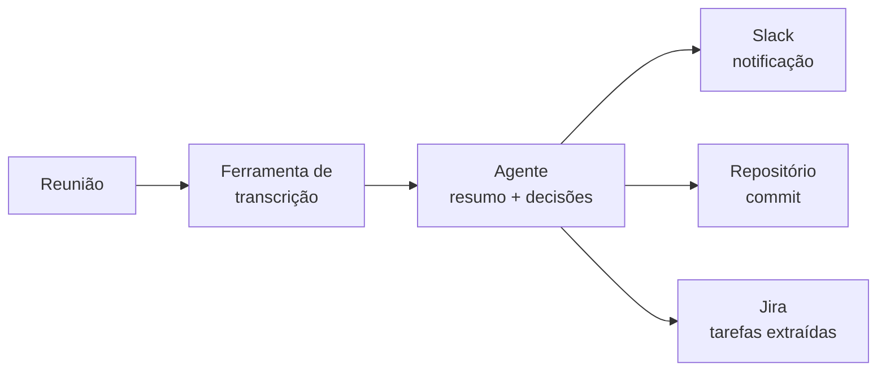

# Diagnóstico e implantação

**Status:** proposta · **Origem:** conversa de 2026-09-01 · **Sustenta:**
[A Assistente](./assistente.md) · [Cards](./assistente-cards.md)

> Como a gente vende e entrega automação sem virar refém de pedido infinito: cardápio de módulos,
> pré-requisitos declarados, fila visível e prazo que vale.

---

## 1. Por que esse documento existe

A Assistente cria uma expectativa nova: se o cliente conversa todo dia com a Vértice e vê o que
está acontecendo, ele vai pedir coisa. Isso é bom — é o caminho natural pra vender automação como
produto, não só tráfego. Mas sem contrato de prioridade, vira trabalho infinito não pago e prazo
que ninguém cumpre.

A regra que resolve isso é uma só, e ela precisa ser dita ao cliente sem constrangimento:

> **O que não foi priorizado não existe. E quem prioriza é o cliente, dentro da capacidade
> contratada.**

Isso não é desculpa — é o que transforma "vocês não fizeram" em "eu escolhi outra coisa primeiro".

## 2. O diagnóstico

Antes de prometer qualquer automação, uma sessão de inventário. Três colunas:

| O que ele **tem** | O que ele **quer receber** | O que **falta** |
|---|---|---|
| Contas de anúncio e nível de acesso | Notificação diária no WhatsApp | Número no grupo, acesso à API |
| Plataforma de e-commerce / CRM | Faturamento junto do investimento | Integração com a plataforma |
| Ferramentas assinadas (Slack? Notion? transcrição?) | Transcrição de reunião no repositório | Assinatura da ferramenta |
| Quem no time olha o quê | Alguém do financeiro no grupo de saldo | Mapear as pessoas |

O diagnóstico produz duas coisas:

1. **Lista de pré-requisitos com dono.** Cada item diz quem resolve — Vértice ou cliente — e o que
   custa. Ferramenta que o cliente precisa assinar aparece aqui, com preço, antes de entrar no
   cronograma. Nada de descobrir na semana 3 que a automação depende de uma assinatura que ninguém
   comprou.
2. **Escopo do ciclo.** O que entra nas primeiras semanas, na ordem que o cliente escolheu.

Limitação técnica do lado do cliente é **achado de diagnóstico, não surpresa de implantação.**
Toda vez que ela aparece depois, o custo é confiança.

## 3. SLAs por classe de pedido

Nem todo pedido é igual, e tratar todos como "vou verificar" é o que quebra a percepção de
atendimento. Quatro classes, com promessa diferente:

| Classe | Exemplo | Prazo | Quem executa |
|---|---|---|---|
| **Consulta** | "quanto gastei ontem?" | segundos | Assistente, sozinha |
| **Ajuste operacional** | pausar criativo com link quebrado, corrigir UTM | mesmo dia útil | humano, sem entrar na fila |
| **Mudança que gasta dinheiro** | subir campanha, mexer em verba ou targeting | aprovação explícita + janela combinada | humano, com registro |
| **Módulo novo** | "quero relatório de estoque no WhatsApp" | entra no cronograma do ciclo | fila priorizada |

A regra do README continua valendo e vira cláusula de contrato: **dinheiro do cliente exige
humano.** A Assistente informa e pede; nunca executa.

## 4. Cardápio de módulos

Vender "automação" no abstrato é ruim pro cliente e pra gente. Vender item de cardápio, com
pré-requisito e prazo, é o que dá pra assinar. Cada módulo carrega: o que entrega, do que
depende, quanto custa implantar.

| Módulo | Entrega | Pré-requisito do lado do cliente |
|---|---|---|
| **Assistente — notificação** | Níveis 0–2 no grupo de WhatsApp | Pessoas indicadas pro grupo |
| **Assistente — pergunta livre** | Catálogo de consultas 24/7 | Acesso de leitura às contas |
| **Faturamento no relatório** | Receita junto do investimento | Integração com o e-commerce/CRM |
| **Monitor de URL e criativo** | Alerta de link morto, produto esgotado | Nada — já roda |
| **Benchmark de setor** | A mediana do setor junto do número do cliente — "seu 0,7% é bom" | Nenhum do lado do cliente; a Vértice assina a base |
| **Transcrição de reunião** | Resumo e decisões no repositório e no Slack | Assinatura da ferramenta de transcrição |
| **Dashboard** | Painel próprio, dado do dia | Nada — já roda |

O cardápio é o que permite a conversa boa de diagnóstico: *"você quer mensagem chegando no
WhatsApp? Quer transcrição de reunião? Então precisa disso, disso e disso, e leva tanto tempo."*

## 5. Dogfooding: transcrição de reunião

O módulo de transcrição nasce de uma dor interna real: toda reunião hoje custa um pedaço de tempo
depois dela — anotar, lembrar, mover pro lugar certo. O fluxo pretendido é o mesmo que a gente
venderia:

Ordem certa: **usar internamente primeiro, vender depois.** Módulo que a Vértice não roda em si
mesma não deveria entrar no cardápio — a operação da própria casa é o melhor ambiente de teste e
o melhor argumento de venda.

Pré-requisito declarado: a assinatura da ferramenta de transcrição. Hoje não existe; é uma decisão
de custo, não técnica.

## 6. Como o cliente enxerga a fila

Transparência de fila é parte do produto, não cortesia:

- O cliente vê **o que está em execução, o que é o próximo e o que está parado**.
- Pedido novo **desloca** algo — a Assistente pergunta o quê, em vez de aceitar tudo e atrasar
  tudo.
- Ciclo com data de fechamento: no fim, o que entregou e o que ficou.

É o mesmo princípio da Assistente aplicado ao trabalho em vez do dado: o cliente não deveria
precisar perguntar em que pé está.

## 7. Em aberto

1. **Unidade de venda** — horas priorizadas por ciclo, ou preço por módulo? Módulo é mais fácil de
   vender e de estimar; hora é mais honesto com pedido exploratório. Possível meio: módulos de
   cardápio com preço fixo + uma cota de horas pro que não está no cardápio.
2. **Onde a fila mora** — Jira já é a ferramenta interna. Falta a visão pro cliente: resumo pela
   Assistente, ou um painel?
3. **Ciclo de quanto tempo?** Quinzenal casa melhor com ritmo de tráfego do que mensal.
4. **Qual ferramenta de transcrição** e quem paga.
5. **Isso vira pacote comercial com nome próprio** ou é o jeito de entregar o que já se vende?
