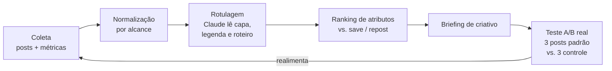

# Radar de conteúdo

**Status:** proposta · **Origem:** conversa de 2026-09-01 · **Primeiro caso:** Casa dos Craques
· **Se conecta com:** [A Assistente](./assistente.md)

> Pegar o que já deu certo — nas contas do cliente e no que é público — achar o padrão por trás,
> e transformar isso em briefing de criativo.

---

## 1. A pergunta original

*"Post que faz sucesso no Instagram hoje tem relação com quanto ele é repostado? O que dá mais
like, mais save, mais repost — dá pra modelar isso?"*

A pergunta tem duas partes, e elas têm respostas bem diferentes.

## 2. O que a API realmente entrega

Esta é a parte que decide se a ideia é viável, então vem antes de qualquer método.

### Nas contas que a gente administra — dado rico

Para conta profissional (Business/Creator) com acesso concedido, o endpoint de mídia e o de
insights entregam, por post:

- `likes`, `comments`, `saved`, `shares`, `views`, `reach`, `total_interactions`
- `profile_visits`, `follows` gerados pelo post
- métricas de Reels (tempo médio assistido, replays)
- **contagem de repost** — métrica adicionada recentemente, em nível de mídia (quantas vezes
  aquele post/Reel foi repostado no perfil de outra pessoa) e em nível de conta

Detalhe importante sobre repost: ela conta **repost público pro perfil**, e **não** inclui
compartilhamento por Stories nem por DM. É métrica diferente do campo `shares` antigo. Ou seja,
"repost" e "compartilhamento" são dois eixos distintos e vale medir os dois separados.

### Nas contas dos outros — dado pobre

Pra concorrente ou conta de referência, o caminho oficial é o *Business Discovery*, e ele só
devolve o que é público:

`followers_count`, `media_count`, `caption`, `media_type`, `media_url`, `permalink`,
`timestamp`, `like_count`, `comments_count`.

**Não** vem `saved`, **não** vem `shares`, **não** vem repost, **não** vem alcance. E ainda:
exige conta profissional pública do outro lado, passa por App Review, e tem limite de ~200
chamadas/hora por conta conectada.

Consequência direta pro projeto:

> **A hipótese de repost só é testável nas contas que a gente administra.** Em conta de terceiro,
> o máximo é like + comentário + recência — sem saves e sem alcance, não dá nem pra normalizar.

Isso não mata a ideia; muda o alvo. O ativo não é espionar concorrente, é **modelar o que
funciona na conta do próprio cliente** — que é onde tem dado de verdade e onde a recomendação
pode ser testada.

E fica o registro do que **não** vamos fazer: scraping de Instagram pra suprir o que a API não dá.
Viola os termos, arrisca o acesso das contas dos clientes e é caro de manter contra mudança de
layout. O limite da API é o limite do produto.

## 3. A hipótese que vale testar

O usuário levantou algo que faz sentido de plataforma: **repost é feature nova, e plataforma
costuma empurrar o que ela acabou de lançar.** Se o algoritmo dá alcance extra pra conteúdo
repostado, então "fazer conteúdo repostável" é uma vantagem temporária — e temporária é
exatamente quando vale correr.

Traduzido em hipótese testável:

> **H1** — entre posts da mesma conta, taxa de repost por alcance prevê alcance futuro melhor do
> que taxa de like por alcance.

Se H1 se confirmar, a consequência prática é forte: parar de otimizar criativo pra like e começar
a otimizar pra "alguém colocar isso no próprio perfil" — que é um conteúdo bem diferente
(declaração, opinião, dado surpreendente, meme de nicho — coisas que dizem algo sobre quem
reposta).

Hipóteses irmãs, mesmo método: **H2** save prevê retorno de audiência (conteúdo de utilidade) ·
**H3** comentário prevê alcance mas não conversão · **H4** o padrão é específico do nicho e não
transfere entre clientes.

## 4. Método

**1. Coleta.** Histórico de mídia + insights das contas do cliente, salvo em base própria. Insight
de Instagram tem janela de retenção — quem não coleta, perde. Começar a coletar é a tarefa mais
urgente do projeto, mesmo antes de existir modelo.

**2. Normalização.** Nada de métrica absoluta. Tudo vira taxa sobre alcance (`saved/reach`,
`repost/reach`), e comparado **dentro da mesma conta e do mesmo período** — conta cresce, alcance
oscila, e comparar post de janeiro com post de agosto sem isso é ruído puro.

**3. Rotulagem.** Claude lê capa, legenda, primeiros segundos e transcrição e marca atributos:
formato, tipo de gancho, duração, tem rosto?, tem texto na capa?, tema, tom, tem CTA?, é UGC?,
é opinião ou utilidade?. É aqui que a análise deixa de ser "qual post foi bem" e vira "qual
**característica** vai bem".

**4. Ranking.** Com dezenas de posts e não milhares, o certo é comparação de médias por atributo
com intervalo de confiança — não regressão sofisticada em cima de N=40. O output honesto é
"posts com gancho de opinião tiveram 2,3× a taxa de repost, em 11 casos".

**5. Briefing.** O achado vira pauta concreta: três ideias de post que carregam o atributo
vencedor, prontas pra produção.

**6. Teste.** O único passo que prova alguma coisa. Sobe 3 com o padrão, 3 sem, mesma semana,
compara. Sem essa etapa, o resto é astrologia com planilha.

### O que pode dar errado na estatística

- **N pequeno.** Uma conta posta 20 vezes por mês. Padrão que aparece em 3 posts não é padrão.
- **Causalidade invertida.** O algoritmo entrega mais o que já performou; o post não foi bem por
  ser bom, foi entregue por ser bom no primeiro minuto. Só o teste do passo 6 separa isso.
- **Confundidor de tema.** "Post com rosto vai melhor" pode ser só "os posts com rosto eram sobre
  o assunto que a audiência gosta".
- **Sazonalidade e mão do editor.** Editor melhora ao longo do tempo; post recente vence post
  antigo por motivo nenhum ligado ao padrão.

Nome honesto do que isso entrega: **gerador de hipótese de criativo**. Quem prova é o teste.

## 5. Como isso vira produto

**Interno primeiro (Casa dos Craques).** Nicho com sinal forte e volume de conteúdo. Se o padrão
aparecer lá, aparece.

**Depois, dentro da Assistente.** Duas conexões naturais com o produto do outro documento:

- **Achado da semana**, empurrado no nível 3+: *"seus 3 posts com mais save no mês tinham dado
  numérico na capa. Sugestão de pauta pra semana: …"*
- **Pergunta livre**, em qualquer nível: *"quais posts mais salvaram esse mês?"*, *"o que está
  funcionando melhor: opinião ou tutorial?"*

**Depois, como serviço vendável.** Aí a limitação do §2 vira parte do contrato: só entra cliente
que dá acesso à conta profissional. Sem acesso, não tem dado; sem dado, não tem produto — e isso
se alinha ao diagnóstico de pré-requisitos descrito em
[Diagnóstico e implantação](./diagnostico-e-implantacao.md).

## 6. Próximo passo concreto

Não é modelar. É **começar a guardar**:

1. Job diário que puxa mídia + insights das contas de Instagram dos clientes que já deram acesso
   e grava em base própria (histórico é ativo, e a janela de retenção da API não espera).
2. Rodar 30 dias.
3. Só então rotular e olhar o ranking — com dado suficiente pra alguma conclusão não ser sorte.

## 7. Em aberto

1. **Quais clientes já têm conta profissional conectada** com permissão de insights? Levantar
   antes de qualquer código.
2. **A contagem de repost está disponível na versão de API que a gente usa hoje?** Confirmar na
   documentação oficial (o acesso a `developers.facebook.com` está bloqueado deste ambiente).
3. **Vale a pena o App Review pro Business Discovery?** Só se a conclusão for "concorrente ajuda a
   pautar" — com like e comentário apenas, provavelmente não paga o esforço.
4. **TikTok entra?** A pergunta original falava em "outras redes"; TikTok tem API própria e outro
   escopo de trabalho.

---

## Fontes consultadas

- [Insights — Instagram Platform, Meta for Developers](https://developers.facebook.com/docs/instagram-platform/insights/)
- [Business Discovery — Meta for Developers](https://developers.facebook.com/documentation/instagram-platform/instagram-api-with-facebook-login/business-discovery)
- [Meta Announces Updates for the Instagram Marketing API — Social Media Today](https://www.socialmediatoday.com/news/meta-announces-updates-for-the-instagram-marketing-api/807083/)
- [Meta rolls out new Instagram API features for branded content and analytics — Social Samosa](https://www.socialsamosa.com/news-2/meta-instagram-api-features-branded-content-analytics-11760299)
- [Instagram Business Discovery API: What Can You Actually Get? — KeyAPI](https://www.keyapi.ai/blog/instagram-business-discovery-api/)
- [How Instagram's Updated Marketing API Metrics Work — Storrito](https://storrito.com/resources/how-instagrams-updated-marketing-api-metrics-work/)
